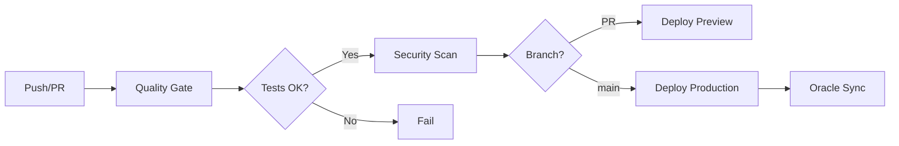

# GitHub Secrets Setup - Checkliste

## 📋 Required Secrets für CI/CD

Gehe zu: `https://github.com/NeXify-Chat-it-Automate-it/OpenCarBox/settings/secrets/actions`

> ⚠️ **Wichtig:** Trage echte Werte ausschließlich in GitHub Secrets ein. Keine Tokens/Keys im Repository committen.

### 🗄️ Supabase Secrets

```bash
NEXT_PUBLIC_SUPABASE_URL
# Wert: https://<project-ref>.supabase.co

NEXT_PUBLIC_SUPABASE_ANON_KEY
# Wert: <supabase-anon-key>

SUPABASE_SERVICE_ROLE_KEY
# Wert: <supabase-service-role-key>

DATABASE_URL
# Wert: postgresql://postgres:<password>@db.<project-ref>.supabase.co:5432/postgres
```

### 🤖 Google AI (Oracle)

```bash
GOOGLE_GENERATIVE_AI_API_KEY
# Wert: <google-generative-ai-api-key>
```

### ☁️ Vercel Deployment

```bash
VERCEL_TOKEN
# Wert: <vercel-token>

VERCEL_PROJECT_ID
# Wert: <vercel-project-id>

VERCEL_ORG_ID
# Wert: <vercel-org-id-or-team-id>
```

### 🔒 Security Scanning (Optional)

```bash
SNYK_TOKEN
# Wert: <snyk-token>
```

### 💳 Stripe (wenn implementiert)

```bash
STRIPE_SECRET_KEY
# Wert: sk_test_... oder sk_live_...

STRIPE_WEBHOOK_SECRET
# Wert: whsec_...
```

### 📧 Resend Email (wenn implementiert)

```bash
RESEND_API_KEY
# Wert: re_...
```

## ✅ Setup-Schritte

1. **GitHub öffnen:**
   ```
   https://github.com/NeXify-Chat-it-Automate-it/OpenCarBox/settings/secrets/actions
   ```

2. **Für jedes Secret:**
   - Klicke "New repository secret"
   - Name: (wie oben)
   - Value: (aus sicherer Quelle kopieren)
   - Klicke "Add secret"

3. **Verifizieren:**
   - Alle Secrets sollten in der Liste erscheinen
   - Bei Push zu `main` sollte CI/CD Pipeline starten

## 🚀 Pipeline-Ablauf



### Quality Gate prüft:
- ✅ TypeScript Type Check
- ✅ ESLint
- ✅ Prettier
- ✅ Tests
- ✅ Build

### Security Scan:
- 🔒 Snyk Vulnerability Check

### Oracle Sync (nur main):
- 📚 Sync docs → Memory
- 📝 Audit Log erstellen

### Deployment:
- 🌐 Vercel Preview (PRs)
- 🚀 Vercel Production (main)

## 🔧 Troubleshooting

### Pipeline schlägt fehl?

1. **Check Secrets:**
   ```bash
   # Lokal testen ob Secrets korrekt sind
   npm run type-check
   npm run test
   npm run build
   ```

2. **Check GitHub Actions Log:**
   - Gehe zu Actions Tab
   - Klicke auf fehlgeschlagenen Run
   - Schaue welcher Step fehlschlug

3. **Häufige Fehler:**
   - `DATABASE_URL missing` → Secret falsch gesetzt
   - `VERCEL_TOKEN invalid` → Token abgelaufen
   - `Build failed` → Lokale Probleme, erst lokal fixen

## 📊 Status-Badge

Füge in README.md ein:

```markdown

```

## 🔄 Auto-Deployment

Nach Setup:
- ✅ Push zu `main` → Automatisches Production Deployment
- ✅ Pull Request → Preview Deployment
- ✅ Tests bestanden → Automatisches Merge (optional)

---

**Setup-Zeit:** ~10 Minuten
**Wartung:** Automatisch
**Status:** 🟢 Bereit für Automation
