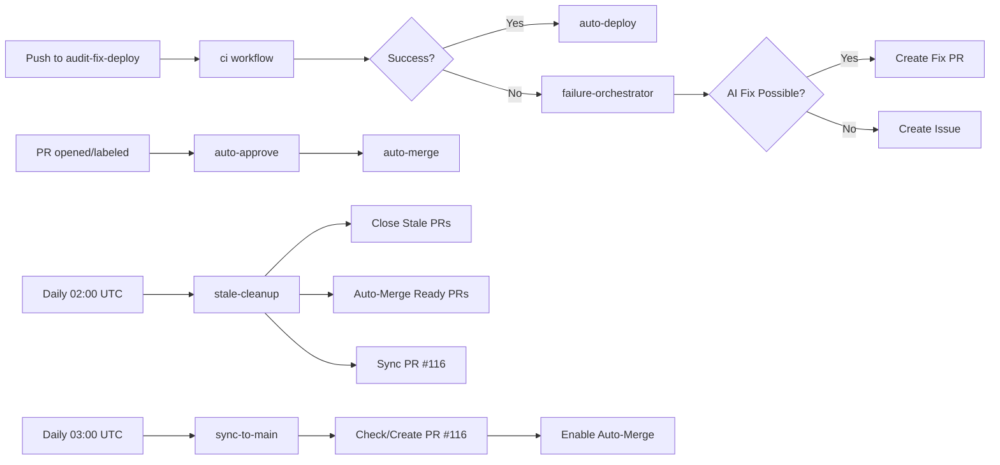

# Autonomous Operations Architecture

> **Goal**: Complete autonomous operation with zero human confirmation for routine tasks.

## Overview

This repository operates with **full autonomy** for routine operations. After initial setup, no human confirmation is required for:

- Auto-merging trusted PRs
- Cleaning up stale/superseded PRs
- Syncing changes from audit-fix-deploy → main
- Deploying to production on default branch
- AI-powered failure triage and fixes

## Architecture Components

### 1. Auto-Merge Pipeline (`.github/workflows/auto-merge.yml`)

**Purpose**: Automatically approve and merge PRs from trusted actors when CI passes.

**Triggers**:
- `pull_request` events: `labeled`, `opened`, `synchronize`, `reopened`
- `workflow_run` completion of `ci`

**Conditions for Auto-Merge**:
- ✅ PR is from trusted actor:
  - `copilot-swe-agent[bot]`
  - `dependabot[bot]`
  - `nexifyai-dev` (repo owner)
- ✅ OR has label: `auto-merge`, `autofix`, `codex`
- ✅ AND all CI checks pass (`gh pr checks`)
- ✅ AND NOT a draft PR
- ✅ AND from same repository (not fork)

**Safety Guards**:
- ❌ PRs touching `.github/workflows/` require human review
- ❌ PRs touching `supabase/migrations/` require human review

**Actions**:
1. Check changed files for protected paths
2. Verify all CI checks pass
3. Auto-approve PR (`gh pr review --approve`)
4. Enable auto-merge (`gh pr merge --squash --auto`)

**Merge Strategy**: Always squash merge for clean history

---

### 2. Auto-Approve Workflow (`.github/workflows/auto-approve.yml`)

**Purpose**: Automatically approve PRs from trusted actors (runs before auto-merge).

**Triggers**:
- `pull_request_target` events: `opened`, `synchronize`, `reopened`, `labeled`, `ready_for_review`
- `pull_request_review_requested`

**Approves**:
- Dependabot PRs (patch/minor version updates)
- PRs from `copilot-swe-agent[bot]`
- PRs from `nexifyai-dev`
- PRs with labels: `auto-merge`, `autofix`, `codex`, `dependencies`

**Why Separate**: Uses `pull_request_target` for security (runs in base context, not PR context).

---

### 3. Stale Cleanup (`.github/workflows/stale-cleanup.yml`)

**Purpose**: Daily cleanup of stale/placeholder/superseded PRs and auto-merge ready PRs.

**Schedule**: Daily at 02:00 UTC + manual dispatch

**Actions**:

#### 3a. Close Codex Placeholder PRs
- Finds PRs with body: `"Codex generated this pull request, but encountered an unexpected error..."`
- Comments: `"🤖 Auto-closed: Codex placeholder PR with no generated content."`
- Closes PR

#### 3b. Close Superseded Codex PRs
- Finds PRs with labels `codex` or `ci` older than 6 hours
- Checks if PR has merge conflicts (`mergeable: CONFLICTING`)
- Comments: `"🤖 Auto-closed: Changes already merged into default branch."`
- Closes conflicting PRs

#### 3c. Auto-Merge Ready PRs
- Finds open non-draft PRs with `auto-merge` label or from `copilot-swe-agent[bot]`
- Checks for protected file changes (workflows, migrations)
- Verifies all CI checks pass
- Auto-approves and enables squash merge

#### 3d. Sync PR #116
- Checks status of PR #116 (`audit-fix-deploy-10646060533465607163` → `main`)
- Enables auto-merge if PR is open and not conflicting
- Prepares PR to merge automatically when CI passes

**Concurrency**: No cancellation (`cancel-in-progress: false`) to ensure cleanup completes.

---

### 4. Sync to Main (`.github/workflows/sync-to-main.yml`)

**Purpose**: Autonomous sync from `audit-fix-deploy-10646060533465607163` branch to `main`.

**Triggers**:
- Push to `audit-fix-deploy-10646060533465607163`
- Schedule: Daily at 03:00 UTC
- Manual dispatch

**Behavior**:

#### If PR #116 exists and is open:
1. Check CI status
2. Enable auto-merge with squash strategy
3. PR will merge when CI passes

#### If PR #116 doesn't exist:
1. Check for commits ahead between branches
2. If commits exist, create PR with:
   - Title: `"chore: sync audit-fix-deploy → main [autonomous]"`
   - Label: `auto-merge`
   - Description documenting sync purpose
3. Enable auto-merge on newly created PR

**Deduplication**: Only one sync PR at a time (PR #116 is tracked).

**Target**: After PR #116 merges, `main` becomes the default branch.

---

### 5. Failure Orchestrator (`.github/workflows/failure-orchestrator.yml`)

**Purpose**: AI-powered triage and auto-fix for workflow failures.

**Triggers**: Completion of any workflow (success or failure)

**Monitored Workflows**:
- All workflows including: `ci`, `auto-merge`, `auto-approve`, `stale-cleanup`, `sync-to-main`, and more

**AI Configuration**:
- `AI_PROVIDER`: `deepseek` (GitHub Models primary, DeepSeek fallback)
- `AI_MAX_CALLS`: `3` (limits AI fix attempts)
- `FORBID_WORKFLOW_EDITS`: `true` (prevents AI from modifying workflows)

**Behavior on Failure**:

1. **Route Failure**: Determine if AI triage is eligible
2. **AI Triage**: 
   - Run safe autofix (format/lint)
   - Validate fix (`pnpm lint && typecheck && test && build`)
   - Create fix PR if successful
   - Fall back to issue creation if fix fails
3. **Deduplication**: Skip if marker already exists for this run ID

**Guardrails**:
- Max 2 open Codex PRs at once (prevents PR spam)
- Fail-closed AI triage (only runs when explicitly eligible)

---

### 6. Auto-Deploy (`.github/workflows/auto-deploy.yml`)

**Purpose**: Zero-confirmation production deploy on default branch.

**Triggers**:
- Completion of `ci` workflow (when successful)
- Manual dispatch

**Conditions**:
- CI passed
- Push to default branch (currently `audit-fix-deploy-10646060533465607163`, will be `main`)
- Vercel secrets configured

**Behavior**:
1. Check if `VERCEL_TOKEN` is set
2. Skip gracefully if not configured
3. Pull Vercel environment (production)
4. Build project with `pnpm dlx vercel build --prod`
5. Deploy with `pnpm dlx vercel deploy --prebuilt --prod`
6. Comment deployment URL on commit
7. Fail hard on deploy errors (`continue-on-error: false`)

**Concurrency**: `cancel-in-progress: true` (only latest deploy runs)

**No Manual Approval**: Removed any `environment:` blocks requiring approval.

---

## Trigger Map



---

## Auto-Merge Policy

### ✅ Auto-Merged Automatically

1. **Dependabot PRs** (patch/minor updates only)
2. **Copilot SWE Agent PRs** (AI-generated fixes)
3. **nexifyai-dev PRs** (repo owner)
4. **PRs with labels**: `auto-merge`, `autofix`, `codex`

**Requirements**:
- ✅ All CI checks pass
- ✅ Not a draft PR
- ✅ From same repository (not fork)
- ✅ Does NOT touch `.github/workflows/`
- ✅ Does NOT touch `supabase/migrations/`

### ❌ Requires Human Review

1. **PRs touching workflows** (`.github/workflows/*.yml`)
2. **PRs touching migrations** (`supabase/migrations/*`)
3. **Dependabot major version updates**
4. **PRs from external contributors** (forks)
5. **Draft PRs**

---

## Cleanup Policy

### 🗑️ Auto-Closed Automatically

1. **Codex placeholder PRs**: PRs with error message in body
2. **Superseded Codex PRs**: 
   - Have `codex` or `ci` label
   - Older than 6 hours
   - Conflicting with base branch
3. **Stale needs-info issues**: 
   - Have `needs-info` label
   - No activity for 14 days
   - Closed after 7 additional days

### 🔒 Protected from Auto-Close

- Issues with labels: `security`, `production`, `data-loss`, `priority:critical`
- PRs without specific stale markers
- Recently created PRs (< 6 hours)

---

## Sync-to-Main Policy

### 📊 Current State

- **Working Branch**: `audit-fix-deploy-10646060533465607163`
- **Target Branch**: `main`
- **Sync PR**: #116
- **Default Branch**: Will be `main` after PR #116 merges

### 🔄 Sync Behavior

1. **Daily Sync** (03:00 UTC):
   - Check if changes exist
   - Create/update PR #116
   - Enable auto-merge

2. **Push Sync**:
   - On every push to `audit-fix-deploy-10646060533465607163`
   - Updates PR #116
   - Waits for CI before merging

3. **Merge Strategy**:
   - Always squash merge
   - Single commit on `main`
   - Clean linear history

### 🎯 After PR #116 Merges

1. Set `main` as default branch (manual one-time action)
2. Future PRs target `main` directly
3. `audit-fix-deploy` branch can be deleted or repurposed
4. `sync-to-main` workflow becomes dormant (or removed)

---

## Runner Configuration

All workflows use centralized runner control (ADR-010):

```yaml
runs-on: ${{ vars.RUNNER || 'ubuntu-latest' }}
```

**Repository Variable**: `RUNNER`

**Options**:
- Not set / empty: Use GitHub-hosted `ubuntu-latest` (default)
- `"self-hosted"`: Use self-hosted runner
- Custom label (e.g. `"self-hosted-build"`): Use specific runner with that label

**Why**: Centralized control allows switching entire infrastructure without editing workflows. See ADR-011 for self-hosted runner deployment details.

---

## What Runs Automatically vs What Requires Human Action

### 🤖 Fully Autonomous (No Human Needed)

1. ✅ Auto-approve trusted PRs
2. ✅ Auto-merge PRs when CI passes
3. ✅ Close stale/placeholder PRs
4. ✅ Deploy to production on default branch
5. ✅ AI triage and fix workflow failures
6. ✅ Sync changes to main branch
7. ✅ Install dependencies (Dependabot auto-merge)
8. ✅ Format and lint fixes

### 👤 Requires Human Action

1. ❌ Initial repository setup (this bootstrap)
2. ❌ Secrets rotation (API keys, tokens)
3. ❌ Branch protection configuration
4. ❌ Workflow file changes (`.github/workflows/`)
5. ❌ Database migrations (`supabase/migrations/`)
6. ❌ Major dependency updates (Dependabot)
7. ❌ Setting default branch (after PR #116 merges)
8. ❌ Breaking changes requiring coordination

---

## Safety Mechanisms

### 1. Protected Paths
- `.github/workflows/*.yml` → Human review required
- `supabase/migrations/*` → Human review required

### 2. AI Guardrails
- `AI_MAX_CALLS: '3'` → Prevents infinite AI loops
- `FORBID_WORKFLOW_EDITS: 'true'` → AI cannot modify workflows
- `max_conflict_files: '10'` → Limits scope of AI fixes
- `max_file_bytes: '200000'` → Prevents large file corruption

### 3. Concurrency Controls
- Unique groups per workflow/PR
- `cancel-in-progress` on deploys (latest wins)
- No cancellation on cleanup (ensures completion)

### 4. Deduplication
- Run ID markers prevent duplicate triage
- Single sync PR at a time (#116 tracked)
- Existing marker checks before creating issues/PRs

### 5. Fail-Closed Behavior
- AI triage only runs when explicitly eligible
- Deploy fails hard on errors (no silent failures)
- All safety checks must pass before merge

---

## Dependencies and Integrations

### External Services
- **Vercel**: Production deployments
- **Supabase**: Database and auth
- **DeepSeek**: AI provider for triage/fixes
- **NSCALE**: AI fallback provider
- **GitHub Models**: Primary AI provider

### GitHub Features
- **Auto-merge**: Repository-level feature (must be enabled)
- **GITHUB_TOKEN**: Workflow permissions (read+write)
- **Repository Variables**: `RUNNER`
- **Repository Secrets**: All API keys/tokens

### Required Secrets
- `VERCEL_TOKEN`, `VERCEL_ORG_ID`, `VERCEL_PROJECT_ID`
- `NEXT_PUBLIC_SUPABASE_URL`, `NEXT_PUBLIC_SUPABASE_ANON_KEY`
- `SUPABASE_SERVICE_ROLE_KEY`, `DATABASE_URL`
- `DEEPSEEK_API_KEY`, `NSCALE_API_KEY`

---

## Monitoring and Observability

### How to Monitor Autonomous Operations

1. **GitHub Actions Tab**: All workflow runs visible
2. **Pull Requests**: Check for `auto-merge` label and status
3. **Issues**: `failure-routing` and `ai-triage` labels show triage activity
4. **Commit Comments**: Deploy URLs commented on commits
5. **Branch Status**: Check CI status badges

### Key Metrics to Track

- Auto-merge success rate
- AI fix success rate vs. fallback to issues
- Stale PR cleanup count (daily)
- Deployment frequency and success rate
- Workflow failure rate

### Alerts and Notifications

- Deploy failures trigger `notify-failure` job (logs failure)
- AI triage creates issues when fix not possible
- Stale cleanup comments on closed PRs
- Failure orchestrator creates routing issues

---

## Troubleshooting

### Auto-Merge Not Working

1. Check if auto-merge enabled at repo level:
   ```bash
   gh api repos/:owner/:repo --jq '.allow_auto_merge'
   ```

2. Check branch protection rules:
   ```bash
   gh api repos/:owner/:repo/branches/main/protection
   ```

3. Ensure `GITHUB_TOKEN` has write permissions:
   - Settings → Actions → General → Workflow permissions

4. Verify PR meets conditions:
   - From trusted actor or has label
   - All CI checks pass
   - Not touching protected paths

### Stale Cleanup Not Running

1. Check workflow schedule: Daily at 02:00 UTC
2. Verify workflow is enabled:
   ```bash
   gh workflow list
   ```
3. Run manually:
   ```bash
   gh workflow run stale-cleanup.yml
   ```

### Sync to Main Not Working

1. Check if PR #116 exists:
   ```bash
   gh pr view 116
   ```
2. Verify source branch exists:
   ```bash
   git branch -r | grep audit-fix-deploy
   ```
3. Check for merge conflicts:
   ```bash
   gh pr view 116 --json mergeable
   ```

### AI Triage Not Creating Fix PRs

1. Check AI provider secrets are set:
   ```bash
   gh secret list | grep -E 'DEEPSEEK|NSCALE'
   ```
2. Check PR backlog (max 2 open Codex PRs):
   ```bash
   gh pr list --search 'head:codex/'
   ```
3. Review failure-orchestrator logs for eligibility

---

## Future Enhancements

Potential improvements to autonomous operation:

1. **Smart Rollback**: Auto-rollback on production errors
2. **Performance Monitoring**: Auto-optimize based on metrics
3. **Dependency Health**: Proactive security updates
4. **Cost Optimization**: Dynamic runner selection based on workload
5. **Multi-Environment**: Autonomous staging → production promotion
6. **Change Velocity**: ML-based risk assessment for auto-merge

---

## References

- Bootstrap script: `tools/setup/autonomous-bootstrap.sh`
- Workflow runbook: `NOTES/runbook.md`
- Repository brain: `NOTES/brain.md`
- Auto-merge workflow: `.github/workflows/auto-merge.yml`
- Stale cleanup workflow: `.github/workflows/stale-cleanup.yml`
- Sync workflow: `.github/workflows/sync-to-main.yml`

---

**Last Updated**: 2026-02-18  
**Status**: ✅ Autonomous operation fully implemented
