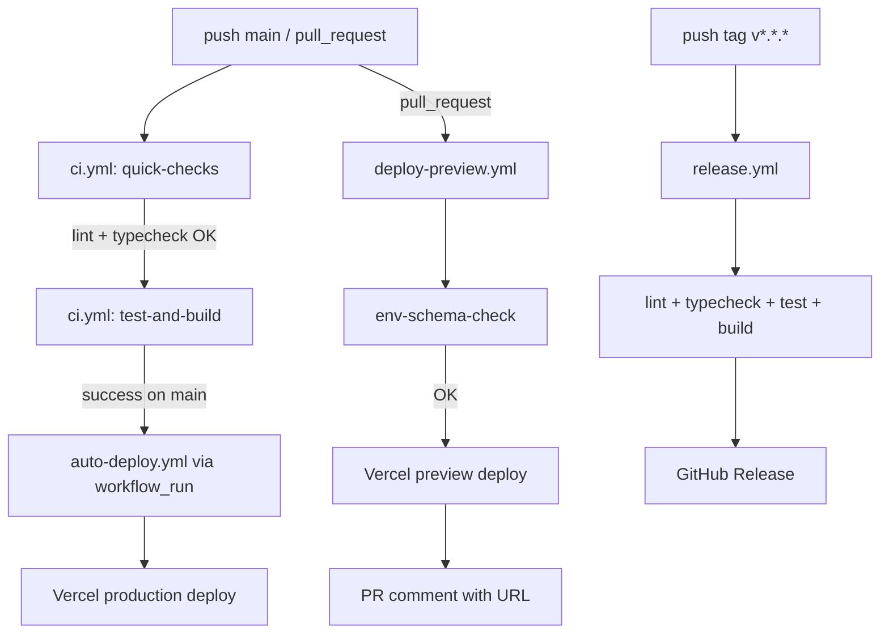

# Runbook

## Operations

- Start local app: `pnpm dev`.
- Validate quality gate: `pnpm lint && pnpm typecheck && pnpm test && pnpm build`.
- Apply Supabase migrations via Supabase CLI or SQL editor using files in `supabase/migrations`.

## AI Provider Policy (Production + CI)

- Zulässig sind ausschließlich **DeepSeek + NSCALE** (`AI_PROVIDER=deepseek`, `DEEPSEEK_API_KEY`, `NSCALE_API_KEY`).
- `OPENAI_*` und andere Provider-SDKs (z. B. Google GenAI) sind nicht freigegeben.
- `tools/guard_no_openai.sh` blockiert Provider-Drift in CI fail-closed.

## API Monitoring (Health + AI Chat)

- **Health Check Polling:** `/api/health` mindestens alle 60 Sekunden abfragen.
  - Alert bei `status !== "ok"` oder HTTP `>= 500`.
  - Dashboard-Felder: `status`, `version`, `dependencies.supabase.status`, `dependencies.supabase.missingEnv`.
- **AI Chat Error Budget:** `/api/ai/chat` nach Error-Codes aufschlüsseln.
  - `VALIDATION_ERROR` (422) und `INVALID_JSON` (400) als Client-Fehler tracken (kein Pager).
  - `RATE_LIMITED` (429) bei Peak-Last monitoren (Warnung, kein Pager).
  - `UPSTREAM_ERROR` (502), `UPSTREAM_TIMEOUT` (504), `INTERNAL_ERROR` (500) pagern bei erhöhtem Anteil.
- **SLO-Vorschlag (Startwert):**
  - p95 Latenz `/api/ai/chat` < 2.5s (ohne Retries), < 8s mit Retries.
  - Fehlerquote `5xx` < 2% pro 10-Minuten-Fenster.
- **Runbook-Hinweis bei Incidents:**
  1. Prüfe `/api/health` und `dependencies.supabase`.
  2. Prüfe Anteil von `UPSTREAM_TIMEOUT` vs. `UPSTREAM_ERROR`.
  3. Falls Timeout-Spike: `AI_CHAT_TIMEOUT_MS` / `AI_CHAT_RETRY_COUNT` temporär absenken.
  4. Falls 429-Spike: `AI_CHAT_RATE_LIMIT_MAX_REQUESTS` und Window prüfen, ggf. Edge-Rate-Limit ergänzen.

## Status Governance
- **Owner:** Tech Lead (oder benannter Release-Manager im aktuellen Sprint).
- **Single Source of Truth:** `docs/tasks/master_plan.md` ist die einzige Truth-Quelle für Task-Status.
- **Aktualisierungsrhythmus:**
  - Bei jedem Merge auf `main` `pnpm report:plan-status` ausführen.
  - Zusätzlich vor jedem Weekly-Status-Update und vor Releases ausführen.
  - Änderungen an Task-Status immer zuerst in `docs/tasks/master_plan.md` pflegen, danach `STATUS_REPORT.md` via Script aktualisieren.

## WIP & Gate-Steuerung

- **Operatives WIP-Limit:** Maximal 3 aktive Tasks gleichzeitig (1x FE, 1x BE/API, 1x DevOps/QA).
- **Gate-Regel:** Ein neuer Task darf erst auf `🔄 IN ARBEIT` gesetzt werden, wenn der vorherige Gate-Task als `✅ ERLEDIGT` markiert und dokumentiert ist.
- **Core-Commerce-Fokus:** Alle nicht aktiven, nicht abgeschlossenen Tasks bleiben auf `⬜ GEPLANT` oder `⏸️ BLOCKED BY CORE COMMERCE`.

### Daily Standup (Pflichtfragen)

1. **Blocker:** Was blockiert dich aktuell (inkl. externer Abhängigkeiten)?
2. **ETA:** Wann erreichst du den aktuellen Task-/Gate-Abschluss realistisch?
3. **Nächster Gate-Check:** Welcher konkrete Nachweis wird bis zum nächsten Check geliefert (z. B. CI grün, Demo, E2E-Flow)?


## Runner Policy

- CI in `.github/workflows/ci.yml` läuft standardmäßig auf `ubuntu-latest` (GitHub-hosted); der Workflow benötigt dafür keine AI-/Deploy-Secrets.
- `actions/setup-node@v4` nutzt `cache: pnpm` + `cache-dependency-path: pnpm-lock.yaml`, damit Cache-Hits auf GitHub-hosted Runnern stabil bleiben.
- Self-hosted Runner können optional für andere Workflows verwendet werden, sind aber keine Voraussetzung für den Standard-CI-Pfad.

### Troubleshooting: Runner unavailable

1. Prüfen, ob der betroffene Workflow wirklich `self-hosted` verlangt (Workflow-Datei kontrollieren).
2. Für CI (`ci.yml`) keine Runner-Recovery nötig: erneut auslösen, der Lauf nutzt `ubuntu-latest`.
3. Für explizit self-hosted Workflows: Runner-Service, Labels und Online-Status in GitHub Settings → Actions → Runners prüfen.
4. Wenn self-hosted länger ausfällt, Workflow temporär auf `ubuntu-latest` umstellen und Incident im Backlog dokumentieren.

## Branch Protection Contract

> These rules **must** be enforced in GitHub Settings → Branches → `main`.
> This section is the authoritative contract; changes require a PR with team review.

| Rule                          | Value                                     |
| ----------------------------- | ----------------------------------------- |
| Protected branch              | `main`                                    |
| Required status checks        | `ci / quick-checks`, `ci / test-and-build` |
| Require PR reviews            | min 1 approval                            |
| Dismiss stale approvals       | recommended (optional)                    |
| Require linear history        | optional                                  |
| Include administrators        | recommended                               |
| Allow force pushes            | **never**                                 |
| Allow deletions               | **never**                                 |

### Optional blocking checks

- `Security` (from `security.yml`) — recommended as required once stable
- `env-schema-check` (from `deploy-preview.yml`) — advisory

## Release Process (SemVer)

### How to release

1. Ensure `main` is green and all PRs are merged.
2. Create a SemVer tag locally:
   ```bash
   git tag v1.2.3
   git push origin v1.2.3
   ```
3. The `release.yml` workflow triggers automatically on `v*.*.*` tags.
4. Alternatively, trigger a release manually via **Actions → Release → Run workflow**.
5. The workflow runs lint, typecheck, test, build, then creates a GitHub Release with auto-generated notes.
6. **No AI is used** for release note generation — notes come from `git log` and GitHub's built-in release notes.

### Versioning policy

- **Major** (`v2.0.0`): Breaking changes to public API or database schema
- **Minor** (`v1.1.0`): New features, non-breaking
- **Patch** (`v1.0.1`): Bug fixes, dependency updates

## Preview vs Production Deployment

| Trigger            | Environment | Workflow              | Vercel flag |
| ------------------ | ----------- | --------------------- | ----------- |
| Pull Request       | Preview     | `deploy-preview.yml`  | (no `--prod`) |
| Push/merge to main | Production  | `auto-deploy.yml`     | `--prod`    |
| Manual dispatch    | Production  | `deploy-prod.yml`     | `--prod`    |

### Environment variables by context

- **Preview**: Uses Vercel Preview environment. Secrets: `VERCEL_TOKEN`, `VERCEL_ORG_ID`, `VERCEL_PROJECT_ID`. No production database credentials.
- **Production**: Uses Vercel Production environment. Full secret set including `DATABASE_URL`, `SUPABASE_SERVICE_ROLE_KEY`.
- **CI**: Only needs build-time vars (`NEXT_PUBLIC_*`). No deploy secrets.

> **Naming convention**: The canonical secret name is `VERCEL_PROJECT_ID`. Legacy alias `VERCEL_PROJEKT_ID` is supported in `auto-deploy.yml` for backwards compatibility but should not be used for new configuration.

## Env Variable Management

### Adding a new environment variable

1. Add the variable with a placeholder to `.env.example`.
2. Run `pnpm env:check` to verify the schema still passes.
3. Set the variable in Vercel Dashboard (Preview + Production) and/or GitHub Secrets as needed.
4. Document the variable's purpose in this runbook if it affects operations.

> **Rule**: `OPENAI_*` variables are explicitly rejected by `tools/check_env_schema.ts` and `tools/guard_no_openai.sh`.

## RLS Smoke Tests

### Running locally

```bash
# Requires Supabase CLI with a running local instance
pnpm db:rls:check
```

This executes `supabase/tests/rls_smoke.sql` against the local Supabase instance and verifies:
- RLS is enabled on security-relevant tables
- Expected policies exist

### In CI

RLS checks are available as a manual `workflow_dispatch` — not blocking CI by default since they require a running Supabase instance.

## Legacy section: Deploy to Vercel

> **Deprecated**: See [Preview vs Production Deployment](#preview-vs-production-deployment) above for the current process.
> This section is kept for historical reference only.

1. Merge only through PR into protected `main`.
2. Ensure required CI checks are green.
3. ~~Deploy to Vercel Preview, then Production.~~ → Now automated via `deploy-preview.yml` (PR) and `auto-deploy.yml` (main).

## Quality Gates by Milestone

- **M1 – Katalog:** `lint` + `typecheck` + `build` sind Pflicht.
- **M2 – Checkout live:** Zusätzlich sind Integrations-Tests für die API und ein E2E Happy Path Pflicht.
- **M3 – Launch:** Zusätzlich sind eine Coverage-Schwelle sowie Performance- und A11y-Checks Pflicht.

## CI/CD Pipeline (final)



### Workflow Responsibilities

- **CI (`.github/workflows/ci.yml`)**
  - Trigger: `push` auf `main` und `pull_request`
  - Stufe 1 (schnell): `quick-checks` mit `lint` + `typecheck`
  - Stufe 2 (langsam): `test-and-build` mit `test` + `build` (nur wenn Stufe 1 erfolgreich)
  - Paketmanager/Cache: **pnpm** + `actions/setup-node` cache `pnpm`
  - Concurrency: ein Lauf pro Branch/PR-Ref, ältere Läufe werden abgebrochen

- **Deploy (`.github/workflows/auto-deploy.yml`)**
  - Trigger:
    - automatisch nur über `workflow_run` nach erfolgreichem `ci` auf `main`
    - manuell über `workflow_dispatch` (optional, für Wartung)
  - Aufgabe: ausschließlich Deployment (Vercel pull/build/deploy)
  - Paketmanager/Cache: **pnpm** + `pnpm dlx`
  - Concurrency: ein Deployment-Lauf pro Branch-Ref

- **Konsolidierung**
  - Es gibt nur noch einen primären CI-Workflow: `.github/workflows/ci.yml`
  - Doppelte Checks aus `.github/workflows/ci-cd.yml` wurden entfernt

## Rollback

- Revert offending commit in GitHub.
- Redeploy previous successful Vercel deployment.
- If migration-related, apply compensating migration (never edit historical migration files).

## Incident Steps

1. Triage impact and severity.
2. Check `/api/health` and CI status.
3. Capture metadata-only logs (no prompts/PII/secrets).
4. Create backlog item with acceptance criteria before closing incident.

### Incident-Handling: Label-Robustheit im Autofix-Fallback

- Der Step `Incident/Issue fallback for failed required checks` in `.github/workflows/autofix.yml` stellt vor `gh issue create` sicher, dass sowohl `incident` als auch `autofix` Label existieren.
- Label-Erstellung ist race-condition-resistent umgesetzt (zweiter Existenzcheck nach fehlgeschlagenem `gh label create`), damit der Fallback nicht an Label-Metadaten scheitert.

## Failure-Orchestrator Ablauf

1. `failure-orchestrator.yml` reagiert auf **alle** fehlgeschlagenen `workflow_run`-Events (außer auf sich selbst).
2. Für `ci`-Fehlschläge bleibt `autofix.yml` für Safe-Autofix-PRs zuständig; der Orchestrator übernimmt das zentrale Routing/Issue-Tracking ohne Secrets im Klartext zu loggen.
3. AI-Triage ist strikt fail-closed und nur aktiv bei erfolgreichem `tools/preflight.ts ai` (`AI_PROVIDER=deepseek`, `DEEPSEEK_API_KEY`, `NSCALE_API_KEY`).
4. Wenn AI-Triage nicht möglich/ausreichend ist, wird ein Incident-/Routing-Issue mit Run-Marker erstellt und Backlog/Runbook werden aktualisiert.

### Pflegeprozess: Workflow-Liste synchron halten (Pflicht)

- Bei **jedem neuen produktiven Workflow** muss in derselben PR auch `.github/workflows/failure-orchestrator.yml` unter `on.workflow_run.workflows` ergänzt werden.
- Die Liste enthält alle produktiven Workflows **außer** `failure-orchestrator` selbst.
- Pflicht-Check vor Merge:
  1. Workflow-Name (`name:`) des neuen Workflows in die Orchestrator-Liste übernehmen.
  2. Deduplizierung prüfen: Marker `run-id:<id>` verhindert doppelte offene PRs/Issues.
  3. Fail-closed prüfen: ohne `AI_PROVIDER=deepseek` + `DEEPSEEK_API_KEY` + `NSCALE_API_KEY` darf keine AI-Triage laufen; stattdessen Routing-Issue.

### Workflow-Repro-Profile

- Der Step `Reproduce failed checks` in `.github/workflows/failure-orchestrator.yml` nutzt eine zentrale Mapping-Tabelle (`WORKFLOW_REPRO_PROFILES`) statt `case`-Verzweigung.
- Jedes Profil enthält die deterministische Befehlsfolge zur Reproduktion je Workflow-Name.
- Aktuelle Profile:
  - `ci`: `pnpm lint`, `pnpm typecheck`, `pnpm test`, `pnpm build`
  - `bootstrap`: `pnpm lint`, `pnpm typecheck`, `pnpm test`, `pnpm build`
  - `Security`: nur sicherheitsrelevanter Check `pnpm audit --prod` (entspricht `security.yml`)
  - `Auto-Deploy Production`: `pnpm lint`, `pnpm typecheck`, `pnpm build`
  - `Deploy Preview`: `npx tsx tools/check_env_schema.ts --ci`, `pnpm build`
  - `Release`: `pnpm lint`, `pnpm typecheck`, `pnpm test`, `pnpm build`
  - `RLS Smoke Tests`: `psql $DATABASE_URL -f supabase/tests/rls_smoke.sql`
  - `__default__`: `pnpm lint`, `pnpm typecheck`
- Pflege-Regel: Bei neuen produktiven Workflows sowohl `on.workflow_run.workflows` als auch das Repro-Profil in derselben PR ergänzen.

## Codex Controller Webhook

### Zweck
- Zentraler Eingangs-Punkt für externe Events zur autonomen Steuerung von `autofix`, `conflict-resolver`, `auto-improve` und Triage-Issue-Erstellung.

### Endpoint
- `POST /api/webhooks/codex-controller`
- Pflicht-Header:
  - `x-codex-signature-256`: `sha256=<hmac>` auf Basis von `CODEX_WEBHOOK_SECRET`
  - `x-codex-event`: Ereignistyp (z. B. `workflow_run.failed`)

### Erforderliche Variablen
- `CODEX_WEBHOOK_SECRET`
- `AI_PROVIDER=deepseek`
- `DEEPSEEK_API_KEY`
- `NSCALE_API_KEY`
- `GH_PAT` (oder `GITHUB_TOKEN`)
- `GITHUB_REPOSITORY` (Format `owner/repo`)

### Betriebslogik
1. Signatur validieren (fail-closed).
2. DeepSeek entscheidet Routing-Aktion (`run_autofix`, `run_conflict_resolver`, `run_auto_improve`, `open_triage_issue`, `ignore`).
3. Bei Aktion ≠ `ignore`: `repository_dispatch` an GitHub senden.
4. Workflow `.github/workflows/codex-controller.yml` startet den passenden Folgeprozess.

### Troubleshooting
- **401 Invalid webhook signature**: Secret-Mismatch zwischen Sender und `CODEX_WEBHOOK_SECRET`.
- **502 ROUTING_FAILED**: Prüfe `GH_PAT/GITHUB_TOKEN` und `GITHUB_REPOSITORY`.
- **Kein Folgeworkflow**: Prüfe `repository_dispatch`-Typ gegen erlaubte Typen in `codex-controller.yml`.
