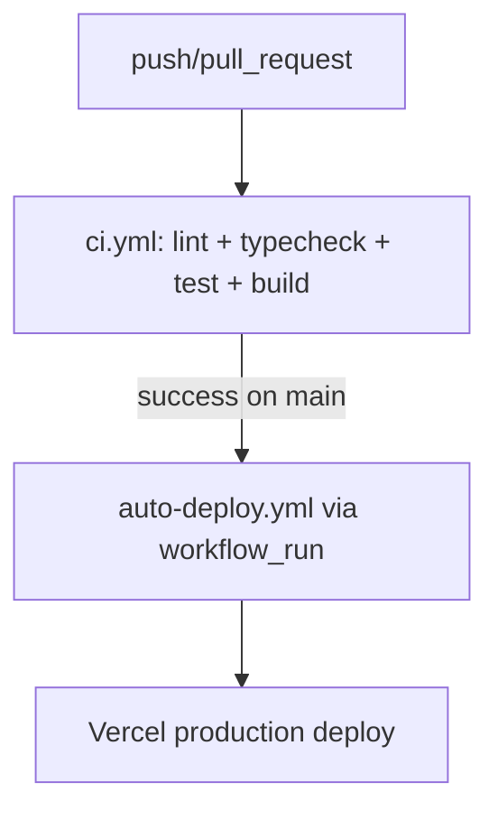

# Runbook

## Operations

- Start local app: `pnpm dev`.
- Validate quality gate: `pnpm lint && pnpm typecheck && pnpm test && pnpm build`.
- Apply Supabase migrations via Supabase CLI or SQL editor using files in `supabase/migrations`.

## Release Process

1. Merge only through PR into protected `main`.
2. Ensure required CI checks are green.
3. Deploy to Vercel Preview, then Production.

## CI/CD Pipeline (final)

### Workflow Responsibilities

- **CI (`.github/workflows/ci.yml`)**
  - Trigger: `push` auf `main` und `pull_request`
  - Validierung: `lint`, `typecheck`, `test`, `build`
  - Paketmanager/Cache: **pnpm** + `actions/setup-node` cache `pnpm`
  - Concurrency: ein Lauf pro Branch/PR-Ref, ältere Läufe werden abgebrochen

- **Deploy (`.github/workflows/auto-deploy.yml`)**
  - Trigger:
    - automatisch nur über `workflow_run` nach erfolgreichem `ci` auf `main`
    - manuell über `workflow_dispatch` (optional, für Wartung)
  - Aufgabe: ausschließlich Deployment (Vercel pull/build/deploy)
  - Paketmanager/Cache: **pnpm** + `pnpm dlx`
  - Concurrency: ein Deployment-Lauf pro Branch-Ref

- **Deprecated (`.github/workflows/ci-cd.yml`)**
  - deaktiviert (nur `workflow_dispatch`, keine aktiven Jobs)
  - bleibt als Platzhalter mit Verweis auf den konsolidierten Pfad erhalten

## Rollback

- Revert offending commit in GitHub.
- Redeploy previous successful Vercel deployment.
- If migration-related, apply compensating migration (never edit historical migration files).

## Incident Steps

1. Triage impact and severity.
2. Check `/api/health` and CI status.
3. Capture metadata-only logs (no prompts/PII/secrets).
4. Create backlog item with acceptance criteria before closing incident.
