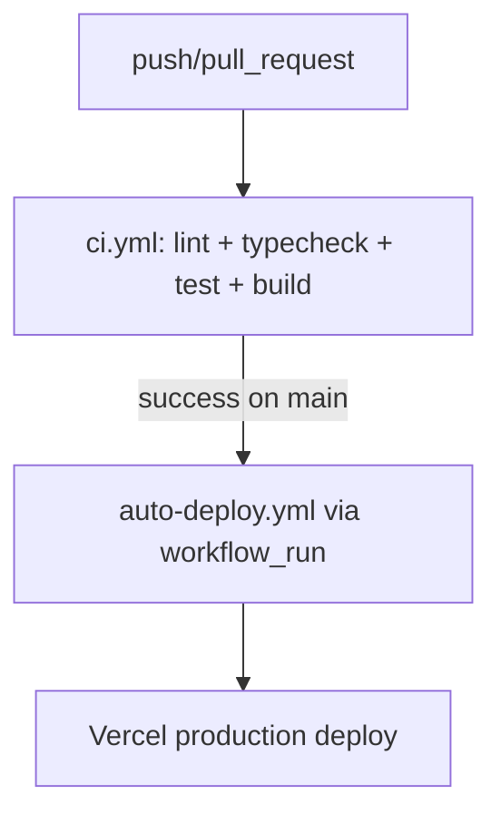

# Runbook

## Operations

- Start local app: `pnpm dev`.
- Validate quality gate: `pnpm lint && pnpm typecheck && pnpm test && pnpm build`.
- Apply Supabase migrations via Supabase CLI or SQL editor using files in `supabase/migrations`.

## Status Governance

- **Owner:** Tech Lead (oder benannter Release-Manager im aktuellen Sprint).
- **Single Source of Truth:** `docs/tasks/master_plan.md` ist die einzige Truth-Quelle für Task-Status.
- **Aktualisierungsrhythmus:**
  - Bei jedem Merge auf `main` `pnpm report:plan-status` ausführen.
  - Für Weekly-Status + KPI-Block `pnpm report:weekly-status` ausführen (liest Tasks + CI-Summary).
  - Zusätzlich vor jedem Weekly-Status-Update und vor Releases ausführen.
  - Änderungen an Task-Status immer zuerst in `docs/tasks/master_plan.md` pflegen, danach `STATUS_REPORT.md` via Script aktualisieren.

<!-- kpi-status:start -->

## KPI-Block (automatisch aktualisiert)

- ⏱️ **PR-Cycle-Time:** 18.4h _(Ziel: <24h)_ ✅
- 🧪 **CI-Durchlaufzeit:** 9.7 min _(Ziel: <12 min)_ ✅
- 🏗️ **Build-Success-Rate:** 96.2% _(Ziel: >95%)_ ✅
- 🐞 **Defect Escape Rate:** 4.7% _(Ziel: <5%)_ ✅
- 🚀 **Deploy-Frequenz:** 7 Deploys / 7 Tage _(Ziel: täglich auf Preview)_ ✅
- 🗓️ **Zuletzt aktualisiert:** 2026-02-16

> Quelle: `docs/tasks/master_plan.md` + `reports/ci-weekly-summary.json` (Fallback auf interne Standardwerte).

<!-- kpi-status:end -->

## Release Process

1. Merge only through PR into protected `main`.
2. Ensure required CI checks are green.
3. Deploy to Vercel Preview, then Production.

## Quality Gates by Milestone

- **M1 – Katalog:** `lint` + `typecheck` + `build` sind Pflicht.
- **M2 – Checkout live:** Zusätzlich sind Integrations-Tests für die API und ein E2E Happy Path Pflicht.
- **M3 – Launch:** Zusätzlich sind eine Coverage-Schwelle sowie Performance- und A11y-Checks Pflicht.

## CI/CD Pipeline (final)

### Workflow Responsibilities

- **CI (`.github/workflows/ci.yml`)**
  - Trigger: `push` auf `main` und `pull_request`
  - Validierung: `lint`, `typecheck`, `test`, `build`
  - Paketmanager/Cache: **pnpm** + `actions/setup-node` cache `pnpm`
  - Concurrency: ein Lauf pro Branch/PR-Ref, ältere Läufe werden abgebrochen

- **Deploy (`.github/workflows/auto-deploy.yml`)**
  - Trigger:
    - automatisch nur über `workflow_run` nach erfolgreichem `ci` auf `main`
    - manuell über `workflow_dispatch` (optional, für Wartung)
  - Aufgabe: ausschließlich Deployment (Vercel pull/build/deploy)
  - Paketmanager/Cache: **pnpm** + `pnpm dlx`
  - Concurrency: ein Deployment-Lauf pro Branch-Ref

- **Deprecated (`.github/workflows/ci-cd.yml`)**
  - deaktiviert (nur `workflow_dispatch`, keine aktiven Jobs)
  - bleibt als Platzhalter mit Verweis auf den konsolidierten Pfad erhalten

## Rollback

- Revert offending commit in GitHub.
- Redeploy previous successful Vercel deployment.
- If migration-related, apply compensating migration (never edit historical migration files).

## Incident Steps

1. Triage impact and severity.
2. Check `/api/health` and CI status.
3. Capture metadata-only logs (no prompts/PII/secrets).
4. Create backlog item with acceptance criteria before closing incident.
