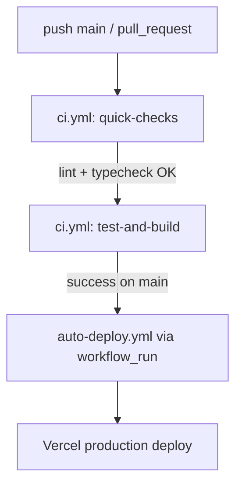

# Runbook

## Operations

- Start local app: `pnpm dev`.
- Validate quality gate: `pnpm lint && pnpm typecheck && pnpm test && pnpm build`.
- Apply Supabase migrations via Supabase CLI or SQL editor using files in `supabase/migrations`.

## API Monitoring (Health + AI Chat)

- **Health Check Polling:** `/api/health` mindestens alle 60 Sekunden abfragen.
  - Alert bei `status !== "ok"` oder HTTP `>= 500`.
  - Dashboard-Felder: `status`, `version`, `dependencies.supabase.status`, `dependencies.supabase.missingEnv`.
- **AI Chat Error Budget:** `/api/ai/chat` nach Error-Codes aufschlüsseln.
  - `VALIDATION_ERROR` (422) und `INVALID_JSON` (400) als Client-Fehler tracken (kein Pager).
  - `RATE_LIMITED` (429) bei Peak-Last monitoren (Warnung, kein Pager).
  - `UPSTREAM_ERROR` (502), `UPSTREAM_TIMEOUT` (504), `INTERNAL_ERROR` (500) pagern bei erhöhtem Anteil.
- **SLO-Vorschlag (Startwert):**
  - p95 Latenz `/api/ai/chat` < 2.5s (ohne Retries), < 8s mit Retries.
  - Fehlerquote `5xx` < 2% pro 10-Minuten-Fenster.
- **Runbook-Hinweis bei Incidents:**
  1. Prüfe `/api/health` und `dependencies.supabase`.
  2. Prüfe Anteil von `UPSTREAM_TIMEOUT` vs. `UPSTREAM_ERROR`.
  3. Falls Timeout-Spike: `AI_CHAT_TIMEOUT_MS` / `AI_CHAT_RETRY_COUNT` temporär absenken.
  4. Falls 429-Spike: `AI_CHAT_RATE_LIMIT_MAX_REQUESTS` und Window prüfen, ggf. Edge-Rate-Limit ergänzen.

## Status Governance
- **Owner:** Tech Lead (oder benannter Release-Manager im aktuellen Sprint).
- **Single Source of Truth:** `docs/tasks/master_plan.md` ist die einzige Truth-Quelle für Task-Status.
- **Aktualisierungsrhythmus:**
  - Bei jedem Merge auf `main` `pnpm report:plan-status` ausführen.
  - Zusätzlich vor jedem Weekly-Status-Update und vor Releases ausführen.
  - Änderungen an Task-Status immer zuerst in `docs/tasks/master_plan.md` pflegen, danach `STATUS_REPORT.md` via Script aktualisieren.

## WIP & Gate-Steuerung

- **Operatives WIP-Limit:** Maximal 3 aktive Tasks gleichzeitig (1x FE, 1x BE/API, 1x DevOps/QA).
- **Gate-Regel:** Ein neuer Task darf erst auf `🔄 IN ARBEIT` gesetzt werden, wenn der vorherige Gate-Task als `✅ ERLEDIGT` markiert und dokumentiert ist.
- **Core-Commerce-Fokus:** Alle nicht aktiven, nicht abgeschlossenen Tasks bleiben auf `⬜ GEPLANT` oder `⏸️ BLOCKED BY CORE COMMERCE`.

### Daily Standup (Pflichtfragen)

1. **Blocker:** Was blockiert dich aktuell (inkl. externer Abhängigkeiten)?
2. **ETA:** Wann erreichst du den aktuellen Task-/Gate-Abschluss realistisch?
3. **Nächster Gate-Check:** Welcher konkrete Nachweis wird bis zum nächsten Check geliefert (z. B. CI grün, Demo, E2E-Flow)?

## Self-hosted GitHub Runner

- CI-Jobs in `.github/workflows/ci.yml` laufen auf `runs-on: self-hosted` statt `ubuntu-latest`.
- Einrichtung eines Linux-Runners (Version `2.331.0`) im Repo-Kontext:
  1. `mkdir actions-runner && cd actions-runner`
  2. `curl -o actions-runner-linux-x64-2.331.0.tar.gz -L https://github.com/actions/runner/releases/download/v2.331.0/actions-runner-linux-x64-2.331.0.tar.gz`
  3. `echo "5fcc01bd546ba5c3f1291c2803658ebd3cedb3836489eda3be357d41bfcf28a7  actions-runner-linux-x64-2.331.0.tar.gz" | shasum -a 256 -c`
  4. `tar xzf ./actions-runner-linux-x64-2.331.0.tar.gz`
  5. `./config.sh --url https://github.com/NeXifyAI-cloud/opencarbox --token <EPHEMERAL_TOKEN>`
  6. `./run.sh`
- Sicherheit: Runner-Token ist kurzlebig und darf nicht committed oder geloggt werden.

## Release Process

1. Merge only through PR into protected `main`.
2. Ensure required CI checks are green.
3. Deploy to Vercel Preview, then Production.

## Quality Gates by Milestone

- **M1 – Katalog:** `lint` + `typecheck` + `build` sind Pflicht.
- **M2 – Checkout live:** Zusätzlich sind Integrations-Tests für die API und ein E2E Happy Path Pflicht.
- **M3 – Launch:** Zusätzlich sind eine Coverage-Schwelle sowie Performance- und A11y-Checks Pflicht.

## CI/CD Pipeline (final)

### Workflow Responsibilities

- **CI (`.github/workflows/ci.yml`)**
  - Trigger: `push` auf `main` und `pull_request`
  - Stufe 1 (schnell): `quick-checks` mit `lint` + `typecheck`
  - Stufe 2 (langsam): `test-and-build` mit `test` + `build` (nur wenn Stufe 1 erfolgreich)
  - Paketmanager/Cache: **pnpm** + `actions/setup-node` cache `pnpm`
  - Concurrency: ein Lauf pro Branch/PR-Ref, ältere Läufe werden abgebrochen

- **Deploy (`.github/workflows/auto-deploy.yml`)**
  - Trigger:
    - automatisch nur über `workflow_run` nach erfolgreichem `ci` auf `main`
    - manuell über `workflow_dispatch` (optional, für Wartung)
  - Aufgabe: ausschließlich Deployment (Vercel pull/build/deploy)
  - Paketmanager/Cache: **pnpm** + `pnpm dlx`
  - Concurrency: ein Deployment-Lauf pro Branch-Ref

- **Konsolidierung**
  - Es gibt nur noch einen primären CI-Workflow: `.github/workflows/ci.yml`
  - Doppelte Checks aus `.github/workflows/ci-cd.yml` wurden entfernt

## Rollback

- Revert offending commit in GitHub.
- Redeploy previous successful Vercel deployment.
- If migration-related, apply compensating migration (never edit historical migration files).

## Incident Steps

1. Triage impact and severity.
2. Check `/api/health` and CI status.
3. Capture metadata-only logs (no prompts/PII/secrets).
4. Create backlog item with acceptance criteria before closing incident.

## Failure-Orchestrator Ablauf

1. `failure-orchestrator.yml` reagiert auf `workflow_run` mit `conclusion == failure` (außer auf sich selbst).
2. Stufe 1: Safe-Autofix (`prettier` + `eslint --fix`) und bei Änderungen automatischer Fix-PR.
3. Stufe 2: Wenn keine Änderungen, AI-Triage nur bei erfolgreichem `tools/preflight.ts ai` (DeepSeek + NSCALE fail-closed).
4. Stufe 3: Wenn AI-Triage nicht möglich oder nicht ausreichend, automatisches Incident-Issue mit Run-Link.
