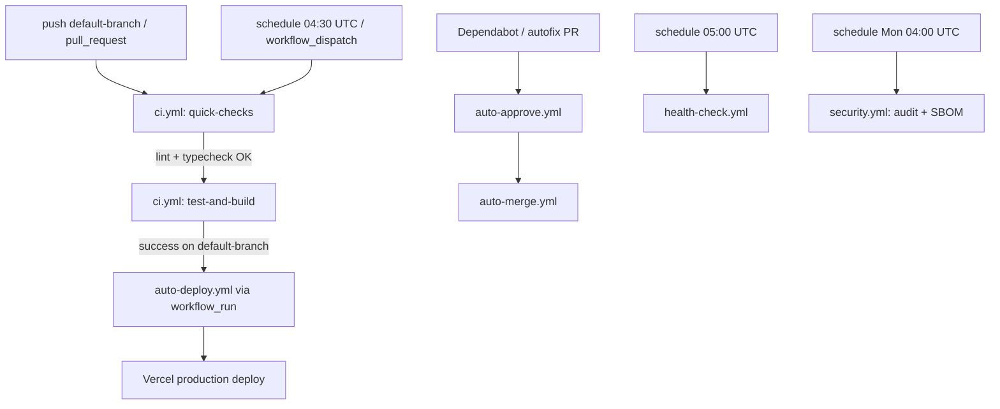

# Runbook

## Operations

- Start local app: `pnpm dev`.
- Validate quality gate: `pnpm lint && pnpm typecheck && pnpm test && pnpm build`.
- Apply Supabase migrations via Supabase CLI or SQL editor using files in `supabase/migrations`.

## AI Provider Policy (Production + CI)

- Zulässig sind ausschließlich **DeepSeek + NSCALE** (`AI_PROVIDER=deepseek`, `DEEPSEEK_API_KEY`, `NSCALE_API_KEY`).
- `OPENAI_*` und andere Provider-SDKs (z. B. Google GenAI) sind nicht freigegeben.
- `tools/guard_no_openai.sh` blockiert Provider-Drift in CI fail-closed.

## API Monitoring (Health + AI Chat)

- **Health Check Polling:** `/api/health` mindestens alle 60 Sekunden abfragen.
  - Alert bei `status !== "ok"` oder HTTP `>= 500`.
  - Dashboard-Felder: `status`, `version`, `dependencies.supabase.status`, `dependencies.supabase.missingEnv`.
- **AI Chat Error Budget:** `/api/ai/chat` nach Error-Codes aufschlüsseln.
  - `VALIDATION_ERROR` (422) und `INVALID_JSON` (400) als Client-Fehler tracken (kein Pager).
  - `RATE_LIMITED` (429) bei Peak-Last monitoren (Warnung, kein Pager).
  - `UPSTREAM_ERROR` (502), `UPSTREAM_TIMEOUT` (504), `INTERNAL_ERROR` (500) pagern bei erhöhtem Anteil.
- **SLO-Vorschlag (Startwert):**
  - p95 Latenz `/api/ai/chat` < 2.5s (ohne Retries), < 8s mit Retries.
  - Fehlerquote `5xx` < 2% pro 10-Minuten-Fenster.
- **Runbook-Hinweis bei Incidents:**
  1. Prüfe `/api/health` und `dependencies.supabase`.
  2. Prüfe Anteil von `UPSTREAM_TIMEOUT` vs. `UPSTREAM_ERROR`.
  3. Falls Timeout-Spike: `AI_CHAT_TIMEOUT_MS` / `AI_CHAT_RETRY_COUNT` temporär absenken.
  4. Falls 429-Spike: `AI_CHAT_RATE_LIMIT_MAX_REQUESTS` und Window prüfen, ggf. Edge-Rate-Limit ergänzen.

## Status Governance
- **Owner:** Tech Lead (oder benannter Release-Manager im aktuellen Sprint).
- **Single Source of Truth:** `docs/tasks/master_plan.md` ist die einzige Truth-Quelle für Task-Status.
- **Aktualisierungsrhythmus:**
  - Bei jedem Merge auf `main` `pnpm report:plan-status` ausführen.
  - Zusätzlich vor jedem Weekly-Status-Update und vor Releases ausführen.
  - Änderungen an Task-Status immer zuerst in `docs/tasks/master_plan.md` pflegen, danach `STATUS_REPORT.md` via Script aktualisieren.

## WIP & Gate-Steuerung

- **Operatives WIP-Limit:** Maximal 3 aktive Tasks gleichzeitig (1x FE, 1x BE/API, 1x DevOps/QA).
- **Gate-Regel:** Ein neuer Task darf erst auf `🔄 IN ARBEIT` gesetzt werden, wenn der vorherige Gate-Task als `✅ ERLEDIGT` markiert und dokumentiert ist.
- **Core-Commerce-Fokus:** Alle nicht aktiven, nicht abgeschlossenen Tasks bleiben auf `⬜ GEPLANT` oder `⏸️ BLOCKED BY CORE COMMERCE`.

### Daily Standup (Pflichtfragen)

1. **Blocker:** Was blockiert dich aktuell (inkl. externer Abhängigkeiten)?
2. **ETA:** Wann erreichst du den aktuellen Task-/Gate-Abschluss realistisch?
3. **Nächster Gate-Check:** Welcher konkrete Nachweis wird bis zum nächsten Check geliefert (z. B. CI grün, Demo, E2E-Flow)?


## Runner Policy

- Alle Workflows nutzen `runs-on: ${{ vars.RUNNER || 'ubuntu-latest' }}` — der Runner wird systemweit über die Repository-Variable `vars.RUNNER` gesteuert (siehe ADR-010, ADR-011).
- **Standard:** Ohne gesetzte Variable laufen alle Workflows auf `ubuntu-latest` (GitHub-hosted).
- `actions/setup-node@v4` nutzt `cache: pnpm` + `cache-dependency-path: pnpm-lock.yaml`, damit Cache-Hits auf GitHub-hosted Runnern stabil bleiben.
- Self-hosted Runner werden über `vars.RUNNER = self-hosted` (oder spezifisches Label wie `self-hosted-build`) aktiviert.

### Self-Hosted Runner Provisioning (ADR-011)

1. **Server-Anforderungen:** Dedizierte VM oder Bare-Metal mit min. 4 CPU, 8 GB RAM, 50 GB SSD, Ubuntu 22.04+.
2. **System-Abhängigkeiten installieren:**
   ```bash
   sudo apt-get update && sudo apt-get install -y git curl jq docker.io
   # Node.js LTS
   curl -fsSL https://deb.nodesource.com/setup_lts.x | sudo -E bash -
   sudo apt-get install -y nodejs
   # pnpm
   corepack enable && corepack prepare pnpm@latest --activate
   # GitHub CLI
   sudo apt-get install -y gh
   ```
3. **Runner-Agent registrieren:** GitHub Settings → Actions → Runners → „New self-hosted runner" — Anweisungen folgen und Label `self-hosted` (oder `self-hosted-build`) vergeben.
4. **Als Systemd-Service starten:**
   ```bash
   sudo ./svc.sh install && sudo ./svc.sh start
   ```
5. **Secrets auf dem Runner hinterlegen:** DeepSeek-/NSCALE-Keys, Supabase- und Vercel-Tokens als Systemd-Umgebungsvariablen (z. B. `/etc/systemd/system/actions.runner.*.service.d/override.conf`) — nicht im Repository speichern.

### Runner-Wechsel

1. **Zu self-hosted:** GitHub Settings → Actions → Variables → `RUNNER` auf `self-hosted` setzen (oder spezifisches Label wie `self-hosted-build`).
2. **Zurück zu GitHub-hosted:** Variable `RUNNER` löschen oder auf `ubuntu-latest` setzen.
3. **Validierung nach Wechsel:** CI-Lauf manuell auslösen und prüfen, dass `pnpm lint`, `pnpm typecheck`, `pnpm test` und `pnpm build` erfolgreich durchlaufen.

### Monitoring & Wartung

- **CPU/RAM/Disk:** Regelmäßig überwachen (z. B. via Prometheus Node Exporter, htop, oder Cloud-Monitoring).
- **Runner-Version:** Runner-Agent regelmäßig aktualisieren — GitHub zeigt in Settings → Runners an, ob ein Update verfügbar ist.
- **OS-Patches:** Monatliches Patch-Fenster definieren; nach Updates CI-Lauf manuell validieren.
- **Node.js/pnpm-Updates:** Bei LTS-Wechsel pnpm/Node.js auf dem Runner aktualisieren und CI-Stack testen.
- **Failover:** Bei Runner-Ausfall `vars.RUNNER` auf `ubuntu-latest` setzen — Workflows fallen automatisch auf GitHub-hosted zurück (kein Code-Change nötig).

### Troubleshooting: Runner unavailable

1. Prüfen, welcher Runner aktiv ist: `vars.RUNNER` in GitHub Settings → Actions → Variables kontrollieren.
2. Falls `vars.RUNNER` nicht gesetzt oder `ubuntu-latest`: keine Runner-Recovery nötig — erneut auslösen.
3. Falls `self-hosted`: Runner-Service, Labels und Online-Status in GitHub Settings → Actions → Runners prüfen.
4. **Sofort-Rollback:** Variable `RUNNER` löschen oder auf `ubuntu-latest` setzen — alle Workflows fallen automatisch auf GitHub-hosted zurück.

## Release Process

1. Merge only through PR into protected `main`.
2. Ensure required CI checks are green.
3. Deploy to Vercel Preview, then Production.

### How to Release (SemVer)

1. Ensure `main` is stable and all CI checks pass.
2. Create and push a SemVer tag:
   ```bash
   git tag v1.2.3
   git push origin v1.2.3
   ```
3. The `release.yml` workflow triggers automatically:
   - Runs full validation: `pnpm lint`, `pnpm typecheck`, `pnpm test`, `pnpm build`
   - Generates release notes from git log (no AI generation)
   - Creates a GitHub Release with changelog
4. Alternatively, trigger manually via **Actions → Release → Run workflow** with the tag name.
5. Verify the GitHub Release was created under **Releases**.

> **Note:** Release notes are generated from git commit history using `git log`. No OpenAI or AI-based generation is used.

## Quality Gates by Milestone

- **M1 – Katalog:** `lint` + `typecheck` + `build` sind Pflicht.
- **M2 – Checkout live:** Zusätzlich sind Integrations-Tests für die API und ein E2E Happy Path Pflicht.
- **M3 – Launch:** Zusätzlich sind eine Coverage-Schwelle sowie Performance- und A11y-Checks Pflicht.

## CI/CD Pipeline (final)



### Workflow Responsibilities

- **CI (`.github/workflows/ci.yml`)**
  - Trigger: `push` auf default branch, `pull_request`, `schedule` (täglich 04:30 UTC), `workflow_dispatch`
  - Pfadfilter: Reine Doku-Änderungen (`*.md`, `docs/`, `NOTES/`, `LICENSE`) lösen keinen Build aus
  - Stufe 1 (schnell): `quick-checks` mit `lint` + `typecheck`
  - Stufe 2 (langsam): `test-and-build` mit `test` + `build` (nur wenn Stufe 1 erfolgreich)
  - Caching: **pnpm** via `actions/setup-node` + **Next.js build cache** via `actions/cache@v4`
  - Concurrency: ein Lauf pro Branch/PR-Ref, ältere Läufe werden abgebrochen

- **Deploy (`.github/workflows/auto-deploy.yml`)**
  - Trigger:
    - automatisch nur über `workflow_run` nach erfolgreichem `ci` auf default branch
    - manuell über `workflow_dispatch` (optional, für Wartung)
  - Aufgabe: ausschließlich Deployment (Vercel pull/build/deploy)
  - Paketmanager/Cache: **pnpm** + `pnpm dlx`
  - Concurrency: ein Deployment-Lauf pro Branch-Ref

- **Auto-Approve (`.github/workflows/auto-approve.yml`)**
  - Trigger: `pull_request_target` (opened/synchronize/reopened)
  - Genehmigt automatisch sichere PRs: Dependabot patch/minor Updates und PRs mit `autofix` Label
  - Verwendet `hmarr/auto-approve-action@v4`

- **Health Check (`.github/workflows/health-check.yml`)**
  - Trigger: `schedule` (täglich 05:00 UTC), `workflow_dispatch`
  - Prüft: lint, typecheck, test, build, dependency freshness
  - Stellt sicher, dass der default branch jederzeit buildbar bleibt

- **Security (`.github/workflows/security.yml`)**
  - Trigger: `pull_request`, `push` auf default branch, `schedule` (wöchentlich Mo 04:00 UTC)
  - Jobs: Dependency Audit + Secret Scan + SBOM-Generierung (Software Bill of Materials)

- **Konsolidierung**
  - Es gibt nur noch einen primären CI-Workflow: `.github/workflows/ci.yml`
  - Doppelte Checks aus `.github/workflows/ci-cd.yml` wurden entfernt

## Rollback

- Revert offending commit in GitHub.
- Redeploy previous successful Vercel deployment.
- If migration-related, apply compensating migration (never edit historical migration files).

## Preview vs Production Deployment

| Aspect | Preview | Production |
|--------|---------|------------|
| **Trigger** | `pull_request` (opened/synchronize/reopened) | `workflow_run` after successful CI on `main` |
| **Workflow** | `deploy-preview.yml` | `auto-deploy.yml` |
| **Vercel flag** | no `--prod` (preview URL) | `--prod` |
| **Environment** | `preview` | `production` |
| **PR Comment** | ✅ Preview URL posted/updated | — |
| **Secrets** | Only `VERCEL_ORG_ID`, `VERCEL_PROJECT_ID`, `VERCEL_TOKEN` | Full deploy secrets (Supabase, DB, etc.) |

### Environment Variables

- **Preview** secrets are configured in GitHub Environment `preview` — only Vercel credentials needed for build.
- **Production** secrets are configured in GitHub Environment `production` — includes Supabase, database, and AI provider keys.
- New env vars must always be added to `.env.example` first, then to the appropriate GitHub Environment.

## Adding New Environment Variables

1. Add the variable to `.env.example` with a placeholder value.
2. Run `pnpm env:check` locally to verify the schema is consistent.
3. Add the variable to the appropriate GitHub Environment (preview/production) or repository secrets.
4. If the variable is optional, add it to the `OPTIONAL_VARS` set in `tools/check_env_schema.ts`.
5. If the variable is only needed in CI builds, add it to the `CI_REQUIRED` array.
6. **Never** add `OPENAI_*` variables (except `OPENAI_COMPAT_*`) — these are rejected by the env check.

## Incident Steps

1. Triage impact and severity.
2. Check `/api/health` and CI status.
3. Capture metadata-only logs (no prompts/PII/secrets).
4. Create backlog item with acceptance criteria before closing incident.

## RLS Smoke Tests

Minimal SQL-based tests to verify Row Level Security is configured correctly.

### Running Locally

```bash
# Requires psql and DATABASE_URL pointing to a Supabase instance
pnpm db:rls:check
```

### What is Tested

- RLS is **enabled** for all public tables (profiles, products, orders, etc.)
- At least one **policy** exists per table
- Tables not yet created are skipped

### In CI

RLS smoke tests are not blocking in CI (no database available). They can be run manually via `workflow_dispatch` or locally against a Supabase instance.

### Incident-Handling: Label-Robustheit im Autofix-Fallback

- Der Step `Incident/Issue fallback for failed required checks` in `.github/workflows/autofix.yml` stellt vor `gh issue create` sicher, dass sowohl `incident` als auch `autofix` Label existieren.
- Label-Erstellung ist race-condition-resistent umgesetzt (zweiter Existenzcheck nach fehlgeschlagenem `gh label create`), damit der Fallback nicht an Label-Metadaten scheitert.

## Failure-Orchestrator Ablauf

1. `failure-orchestrator.yml` reagiert auf **alle** fehlgeschlagenen `workflow_run`-Events (außer auf sich selbst).
2. Für `ci`-Fehlschläge bleibt `autofix.yml` für Safe-Autofix-PRs zuständig; der Orchestrator übernimmt das zentrale Routing/Issue-Tracking ohne Secrets im Klartext zu loggen.
3. AI-Triage ist strikt fail-closed und nur aktiv bei erfolgreichem `tools/preflight.ts ai` (`AI_PROVIDER=deepseek`, `DEEPSEEK_API_KEY`, `NSCALE_API_KEY`).
4. Wenn AI-Triage nicht möglich/ausreichend ist, wird ein Incident-/Routing-Issue mit Run-Marker erstellt und Backlog/Runbook werden aktualisiert.

### Pflegeprozess: Workflow-Liste synchron halten (Pflicht)

- Bei **jedem neuen produktiven Workflow** muss in derselben PR auch `.github/workflows/failure-orchestrator.yml` unter `on.workflow_run.workflows` ergänzt werden.
- Die Liste enthält alle produktiven Workflows **außer** `failure-orchestrator` selbst.
- Pflicht-Check vor Merge:
  1. Workflow-Name (`name:`) des neuen Workflows in die Orchestrator-Liste übernehmen.
  2. Deduplizierung prüfen: Marker `run-id:<id>` verhindert doppelte offene PRs/Issues.
  3. Fail-closed prüfen: ohne `AI_PROVIDER=deepseek` + `DEEPSEEK_API_KEY` + `NSCALE_API_KEY` darf keine AI-Triage laufen; stattdessen Routing-Issue.
  4. Runner: `runs-on: ${{ vars.RUNNER || 'ubuntu-latest' }}` verwenden (nie hartcodiertes `ubuntu-latest`).

### Workflow-Repro-Profile

- Der Step `Reproduce failed checks` in `.github/workflows/failure-orchestrator.yml` nutzt eine zentrale Mapping-Tabelle (`WORKFLOW_REPRO_PROFILES`) statt `case`-Verzweigung.
- Jedes Profil enthält die deterministische Befehlsfolge zur Reproduktion je Workflow-Name.
- Aktuelle Profile:
  - `ci`: `pnpm lint`, `pnpm typecheck`, `pnpm test`, `pnpm build`
  - `bootstrap`: `pnpm lint`, `pnpm typecheck`, `pnpm test`, `pnpm build`
  - `Security`: nur sicherheitsrelevanter Check `pnpm audit --prod` (entspricht `security.yml`)
  - `Auto-Deploy Production`: `pnpm lint`, `pnpm typecheck`, `pnpm build`
  - `__default__`: `pnpm lint`, `pnpm typecheck`
- Pflege-Regel: Bei neuen produktiven Workflows sowohl `on.workflow_run.workflows` als auch das Repro-Profil in derselben PR ergänzen.

## Branch Protection Contract

The following rules **must** be enforced on the `main` branch via GitHub repository settings:

| Rule | Value |
|------|-------|
| **Protected branch** | `main` |
| **Required status checks** | `ci / quick-checks`, `ci / test-and-build` |
| **Blocking security check** | `security` (if configured) |
| **Require PR reviews** | min 1 approval |
| **Dismiss stale approvals** | optional (recommended) |
| **Require linear history** | optional |
| **Allow force push** | disabled |
| **Allow deletions** | disabled |

> **Note:** These rules cannot be enforced via PR — they must be configured in GitHub UI under Settings → Branches → Branch protection rules. This section serves as a documented contract.

## Codex Controller Webhook

### Zweck
- Zentraler Eingangs-Punkt für externe Events zur autonomen Steuerung von `autofix`, `conflict-resolver`, `auto-improve` und Triage-Issue-Erstellung.

### Endpoint
- `POST /api/webhooks/codex-controller`
- Pflicht-Header:
  - `x-codex-signature-256`: `sha256=<hmac>` auf Basis von `CODEX_WEBHOOK_SECRET`
  - `x-codex-event`: Ereignistyp (z. B. `workflow_run.failed`)

### Erforderliche Variablen
- `CODEX_WEBHOOK_SECRET`
- `AI_PROVIDER=deepseek`
- `DEEPSEEK_API_KEY`
- `NSCALE_API_KEY`
- `GH_PAT` (oder `GITHUB_TOKEN`)
- `GITHUB_REPOSITORY` (Format `owner/repo`)

### Betriebslogik
1. Signatur validieren (fail-closed).
2. DeepSeek entscheidet Routing-Aktion (`run_autofix`, `run_conflict_resolver`, `run_auto_improve`, `open_triage_issue`, `ignore`).
3. Bei Aktion ≠ `ignore`: `repository_dispatch` an GitHub senden.
4. Workflow `.github/workflows/codex-controller.yml` startet den passenden Folgeprozess.

### Troubleshooting
- **401 Invalid webhook signature**: Secret-Mismatch zwischen Sender und `CODEX_WEBHOOK_SECRET`.
- **502 ROUTING_FAILED**: Prüfe `GH_PAT/GITHUB_TOKEN` und `GITHUB_REPOSITORY`.
- **Kein Folgeworkflow**: Prüfe `repository_dispatch`-Typ gegen erlaubte Typen in `codex-controller.yml`.

## Issue Triage (Auftrag 21)

### Triage Rules
- **Auto-Labels:** Issues are labeled based on title/body keywords:
  - `type:bug`, `type:feature`, `docs`, `ci`, `security`, `db`, `ai`, `priority:high`
- **Auto-Assign:** New issues are assigned to the repository owner by default.
- **Repro Check (bugs):** Bug reports missing repro steps, expected behavior, or actual behavior get `needs-info` label + a checklist comment.
- **Ready for Dev:** Issues with all required fields get `ready-for-dev` label.

### Label Semantics
| Label | Meaning |
|-------|---------|
| `type:bug` | Bug report |
| `type:feature` | Feature request |
| `status:triage` | Awaiting initial triage |
| `needs-info` | Missing required information from reporter |
| `ready-for-dev` | All info present, ready for development |
| `ci-failure` | CI pipeline failure |
| `autofix-candidate` | Can potentially be auto-fixed (lint/format/deps) |
| `needs-human` | Requires manual investigation |
| `flaky-test` | Test is flaky/non-deterministic |
| `transient` | Transient/network failure |
| `stale` | No activity for 14+ days with needs-info |
| `security` | Security-related issue |
| `priority:critical` | Critical priority |
| `priority:high` | High priority |
| `priority:medium` | Medium priority |
| `priority:low` | Low priority |
| `ci-retry` | Issue tracked for CI retry |

### SLA Policy
- `needs-info` → 14 days idle → `stale` label + warning comment
- `stale` → 7 more days idle → auto-close with reopen instructions
- **Never auto-close:** `security`, `production`, `data-loss`, `priority:critical`

### PR Labeler
- `.github/labeler.yml` auto-labels PRs by changed file paths (frontend, api, db, ci, docs, tests, config, tooling, dependencies)
- Triggered via `pull_request_target` on opened/synchronize

## Loop Orchestrator (Auftrag 22)

### CI Failure → Issue Pipeline
1. CI workflow fails → `loop-orchestrator.yml` creates an issue with:
   - Failed job names + log links
   - Failed step names
   - Branch and commit info
   - Deduplication marker (`ci-run-<id>`)
2. If the failing CI run has an associated PR, a comment is posted with the failure summary.
3. When an issue gets `ready-for-dev` label, an acknowledgment comment is posted.

### Deterministic Summaries Only
- No AI text generation in the loop orchestrator
- All summaries are constructed from GitHub API metadata (job names, step names, URLs)

## CI Retry & Flaky Guard (Auftrag 24)

### Retry Policy
- **Max 1 automatic retry** per failing CI run
- Only retries for **transient** failures (network timeouts, registry errors)
- **Never retries:** lint, typecheck, test, build failures

### Failure Classification (`tools/ci_failure_classify.ts`)
| Class | Retryable | Example Pattern |
|-------|-----------|-----------------|
| `network-transient` | ✅ | ETIMEDOUT, ECONNRESET |
| `registry-timeout` | ✅ | ERR_PNPM_FETCH, registry timeout |
| `lint` | ❌ | ESLint errors |
| `format` | ❌ | Prettier check failed |
| `typecheck` | ❌ | TS errors |
| `test-flaky` | ✅ | Test timed out |
| `test-deterministic` | ❌ | Assertion failures |
| `build` | ❌ | Build/module errors |
| `deps` | ❌ | Lockfile issues |
| `unknown` | ❌ | Unrecognized |

### Flaky Test Handling
- Flaky tests get `flaky-test` label on the tracking issue
- No autofix PR for flaky tests — only tracking
- Existing flaky test issue gets updated with new occurrences

## Autofix Engine (Auftrag 23)

### Safe Fix Rules
The autofix engine (`autofix.yml`) applies ONLY these deterministic fixes:
1. **Format/Lint:** `prettier --write . && eslint . --fix`
2. **Lockfile regeneration:** Only when error is clearly `ERR_PNPM_OUTDATED_LOCKFILE`

### What is NEVER auto-fixed
- TypeScript type errors
- Test assertion failures
- Build errors (module resolution, etc.)
- Database migrations
- Security vulnerabilities
- Any file outside the allowlist

### Validation
After applying fixes, the engine runs the full check suite (lint → typecheck → test → build).
Only creates a PR if ALL checks pass.

## Autofix Guardrails (Auftrag 28)

### Policy (`tools/autofix_policy.ts`)
- **Allowed files:** `src/`, `tests/`, `tools/`, config files
- **Blocked files:** migrations, `.env`, secrets, lockfiles, CODEOWNERS
- **Max changed files:** 20 per autofix PR
- **Max diff size:** 500 lines
- **Cooldown:** 1 autofix PR per SHA per 6 hours
- **PR limit:** Max 2 open autofix PRs at any time

### Concurrency
- Each autofix run is scoped to `autofix-<branch>` concurrency group
- `cancel-in-progress: true` prevents parallel runs

## Stale Issue Policy (Auftrag 25)

- Only targets issues with `needs-info` label
- 14 days no activity → `stale` label + warning
- 7 more days → auto-close
- Exempt labels: `security`, `production`, `data-loss`, `priority:critical`
- Runs daily at 06:00 UTC
- Can be dry-run via `workflow_dispatch`

## Backlog Sync (Auftrag 26)

- Daily job (05:00 UTC) syncs open issues to `NOTES/backlog.md`
- Only replaces the auto-generated block (between `<!-- AUTO:LIVE_ISSUES_START -->` and `<!-- AUTO:LIVE_ISSUES_END -->`)
- Manual backlog notes are preserved
- Issues sorted by priority labels
- Can be triggered via `workflow_dispatch`

## Security Intake (Auftrag 27)

### Audit → Issues
- Weekly scan (Monday 04:00 UTC) runs `pnpm audit`
- High/critical findings create or update a single tracking issue
- Deduplication: reuses existing open security audit issue

### Dependabot Policy
- Auto-merge: patch/minor updates with green CI via `auto-merge.yml`
- Major updates: always require manual review
- GitHub Actions updates: grouped and auto-mergeable with `auto-merge` label
- Security policy violations: never auto-merged

## E2E Loop Verification (Auftrag 29)

See `NOTES/loop-test.md` for the complete end-to-end verification procedure.
