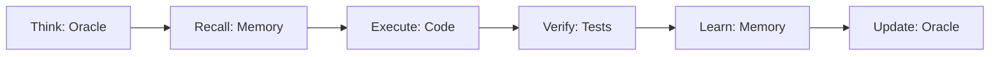

# NeXify Oracle & Memory System

## Übersicht

Das NeXify Oracle & Memory System ist ein selbst-lernendes Wissensmanagementsystem für AI-Agenten, das auf Google Gemini und Supabase basiert.

## Komponenten

### 1. Oracle (`scripts/core/oracle.ts`)

Der Oracle ist die "Denkkomponente" des Systems, die Google Gemini 2.0 Flash Thinking nutzt.

**Funktionen:**
- `think(prompt, context)` - Analysiert Situationen und gibt Empfehlungen
- `optimizeContext(newKnowledge)` - Erweitert den Oracle-Kontext
- `ingestLearning(data)` - Verarbeitet neue Erkenntnisse

**Beispiel:**
```typescript
import { Oracle } from '@/scripts/core/oracle'

const guidance = await Oracle.think(
  "Wie implementiere ich Stripe Webhooks sicher?",
  "Next.js API Routes + TypeScript strict mode"
)
// → { analysis: "...", recommendation: "...", confidence: 0.95 }
```

### 2. Memory (`scripts/core/memory.ts`)

Das Memory-System speichert Wissen persistent in Supabase.

**Tabellen:**
- `project_memory` - Best Practices, Anti-Patterns, Wissen
- `audit_logs` - Protokoll aller Agent-Aktionen

**Funktionen:**
- `remember(params)` - Speichert neue Erkenntnisse
- `recall(query, filter)` - Ruft Wissen ab
- `audit(params)` - Protokolliert Aktionen

**Beispiel:**
```typescript
import { Memory } from '@/scripts/core/memory'

// Wissen speichern
await Memory.remember({
  type: 'BEST_PRACTICE',
  category: 'stripe',
  title: 'Webhook Signature Verification',
  content: 'Always verify webhook signatures using Stripe.webhooks.constructEvent(...)',
  tags: ['stripe', 'security', 'webhooks']
})

// Wissen abrufen
const solutions = await Memory.recall('stripe webhook', { type: 'BEST_PRACTICE' })

// Aktion protokollieren
await Memory.audit({
  action: 'implement_stripe_webhook',
  resource: 'src/app/api/webhooks/stripe/route.ts',
  status: 'SUCCESS',
  durationMs: 1234
})
```

### 3. Sync (`scripts/core/sync.ts`)

Synchronisiert Dokumentation mit dem Memory-System.

## Recursive Intelligence Protocol

Vor **jeder** Code-Änderung:



### Workflow-Beispiel

```typescript
// 1. THINK
const guidance = await Oracle.think(
  "Wie implementiere ich User Authentication?",
  "Supabase Auth + Next.js Middleware"
)

// 2. RECALL
const pastSolutions = await Memory.recall('supabase auth middleware')

// 3. EXECUTE
// ... Code implementieren ...

// 4. VERIFY
// ... Tests ausführen ...

// 5. LEARN (Bei Erfolg)
await Memory.remember({
  type: 'BEST_PRACTICE',
  category: 'auth',
  title: 'Supabase Auth Middleware Pattern',
  content: guidance.recommendation,
  tags: ['supabase', 'auth', 'middleware']
})

// 5. LEARN (Bei Fehler)
await Memory.remember({
  type: 'ANTIPATTERN',
  category: 'auth',
  title: 'Fehler: Auth ohne Cookie-Handling',
  content: `Problem: ${error.message}\nLösung: ${fix}`,
  tags: ['supabase', 'auth', 'error']
})

// 6. UPDATE
await Oracle.optimizeContext(guidance.recommendation)
```

## Setup

### 1. Environment Variables

```bash
# .env
GOOGLE_GENERATIVE_AI_API_KEY=your-google-key
AGENT_MODEL=gemini-2.0-flash-thinking-exp-01-21
NEXT_PUBLIC_SUPABASE_URL=your-supabase-url
SUPABASE_SERVICE_ROLE_KEY=your-service-role-key
```

### 2. Datenbank Migration

```bash
# Prisma Migration
npm run db:push

# Oder direkt SQL in Supabase
# Ausführen: supabase/migrations/003_nexify_memory.sql
```

### 3. Test

```bash
# Oracle testen
npx tsx scripts/test-oracle.ts

# Memory prüfen
npm run db:studio
# → Öffnet Prisma Studio
# → Tabellen: project_memory, audit_logs
```

## Memory Types

| Type | Verwendung | Beispiel |
|------|-----------|----------|
| `BEST_PRACTICE` | Bewährte Patterns | "RLS immer aktiviert" |
| `ANTIPATTERN` | Fehler + Lösungen | "Kein any Type verwenden" |
| `KNOWLEDGE` | Architektur-Wissen | "Drei Verticals: Shop, Werkstatt, Autohandel" |
| `TODO` | Offene Aufgaben | "Stripe Webhooks implementieren" |

## Audit Status

| Status | Bedeutung |
|--------|-----------|
| `SUCCESS` | Erfolgreich ausgeführt |
| `FAILURE` | Fehler aufgetreten |
| `WARNING` | Warnung (z.B. deprecated code) |

## Best Practices

### 1. Vor größeren Änderungen

```typescript
// IMMER zuerst Oracle fragen
const guidance = await Oracle.think(
  "What's the best approach for [task]?",
  "Current architecture: [context]"
)
```

### 2. Nach erfolgreicher Implementierung

```typescript
// Wissen speichern
await Memory.remember({
  type: 'BEST_PRACTICE',
  category: 'relevant-category',
  title: 'Descriptive Title',
  content: 'Detailed explanation...',
  tags: ['tag1', 'tag2']
})
```

### 3. Bei Fehlern

```typescript
// Fehler + Lösung dokumentieren
await Memory.remember({
  type: 'ANTIPATTERN',
  category: 'error-category',
  title: `Error: ${error.name}`,
  content: `Problem: ${error.message}\n\nLösung: ${solution}`,
  tags: ['error', 'fixed']
})

// Audit Log
await Memory.audit({
  action: 'fix_bug',
  resource: 'path/to/file.ts',
  status: 'SUCCESS',
  details: { error: error.message, solution }
})
```

### 4. Kontinuierliche Verbesserung

```typescript
// Regelmäßig Memory abfragen
const learnings = await Memory.recall('current task context')

// Oracle mit neuem Wissen füttern
for (const learning of learnings) {
  await Oracle.ingestLearning(learning)
}
```

## Troubleshooting

### Problem: Oracle antwortet nicht

```typescript
// Prüfe API Key
console.log(process.env.GOOGLE_GENERATIVE_AI_API_KEY?.slice(0, 10))

// Prüfe Model Name
console.log(process.env.AGENT_MODEL)
```

### Problem: Memory speichert nicht

```bash
# Prüfe Supabase Connection
npm run db:studio

# Prüfe Migration
npm run db:push
```

### Problem: Recall findet nichts

```typescript
// Full-text search benötigt Inhalt
const all = await Memory.recall('*') // Alle abrufen

// Oder mit Filter
const filtered = await Memory.recall('query', {
  type: 'BEST_PRACTICE',
  category: 'stripe'
})
```

## Performance

- Oracle-Calls: ~2-5 Sekunden (je nach Prompt-Komplexität)
- Memory Write: ~50-200ms
- Memory Recall: ~50-100ms (mit Index)
- Audit Log: ~30-50ms

## Sicherheit

- Oracle: API Key nur in .env
- Memory: RLS aktiviert, Service Role benötigt
- Audit Logs: Readonly für normale User

---

**Status:** Production Ready ✅
**Model:** Gemini 2.0 Flash Thinking Exp
**Storage:** Supabase PostgreSQL
