# Datenfluss - OpenCarBox & Carvantooo

> **SYSTEM-ARCHITEKTUR: Datenfluss-Diagramme**
> Veranschaulicht den Datenfluss zwischen Frontend, Backend und Datenbank.

---

## 🔄 Übersicht Datenfluss


---

## 📊 E-Commerce Datenfluss (Shop)

### Produktabfrage

```mermaid
sequenceDiagram
    participant U as User (Browser)
    participant C as React Component
    participant Q as TanStack Query
    participant A as API Route
    participant S as Supabase
    participant M as Meilisearch
    
    U->>C: Seite laden
    C->>Q: useQuery('products')
    Q->>A: GET /api/products
    A->>M: Suche Produkte
    M-->>A: Ergebnisse
    A->>S: Enrich mit Details
    S-->>A: Vollständige Daten
    A-->>Q: JSON Response
    Q-->>C: Daten + Loading State
    C-->>U: UI aktualisieren
```



### Bestellabwicklung

```mermaid
sequenceDiagram
    participant U as User
    participant C as Checkout
    participant A as API Route
    participant ST as Stripe
    participant S as Supabase
    participant E as Email Service
    
    U->>C: Bestellung aufgeben
    C->>A: POST /api/orders
    A->>S: Bestellung erstellen (status: pending)
    S-->>A: Order ID
    
    A->>ST: Stripe Payment Intent
    ST-->>A: Payment Intent ID
    
    A->>S: Order updaten (payment_intent_id)
    A-->>C: Redirect zu Stripe
    
    U->>ST: Zahlung abschließen
    ST->>A: Webhook (payment.succeeded)
    
    A->>S: Order Status → 'confirmed'
    A->>E: E-Mail senden (Bestellbestätigung)
    E-->>U: E-Mail erhalten
```



---

## 🔧 Werkstatt-Datenfluss

### Terminbuchung

```mermaid
sequenceDiagram
    participant U as User
    participant B as Booking Widget
    participant A as API Route
    participant S as Supabase
    participant E as Email Service
    participant W as WhatsApp
    
    U->>B: Termin auswählen
    B->>A: POST /api/appointments
    A->>S: Prüfe Verfügbarkeit
    S-->>A: Verfügbar
    
    A->>S: Appointment erstellen (status: pending)
    S-->>A: Appointment ID
    
    A->>E: E-Mail senden (Bestätigung)
    A->>W: WhatsApp Nachricht (optional)
    
    A-->>B: Erfolg
    B-->>U: Bestätigung anzeigen
```



---

## 🚗 Fahrzeugsuche (HSN/TSN)

### HSN/TSN-Lookup

```mermaid
sequenceDiagram
    participant U as User
    participant F as Vehicle Finder
    participant A as API Route
    participant T as TecDoc API
    participant S as Supabase
    
    U->>F: HSN/TSN eingeben
    F->>A: GET /api/vehicles/hsn-tsn?hsn=XXX&tsn=YYY
    A->>T: Fahrzeugdaten abfragen
    T-->>A: Fahrzeug-Info (Marke, Modell, Jahr)
    
    A->>S: Prüfe Kompatibilität (product_vehicle_compatibility)
    S-->>A: Passende Produkte
    
    A-->>F: Fahrzeugdaten + Produkte
    F-->>U: Ergebnisse anzeigen
```



---

## 💾 Zustand-Management

### Client-State (Zustand)

```typescript
// Warenkorb Store
cartStore: {
  items: CartItem[];
  addItem();
  removeItem();
  updateQuantity();
  clear();
}

// Garage Store (Fahrzeuge)
garageStore: {
  vehicles: Vehicle[];
  primaryVehicle: Vehicle | null;
  addVehicle();
  setPrimary();
}

// UI Store
uiStore: {
  sidebarOpen: boolean;
  theme: 'light' | 'dark';
  toggleSidebar();
  setTheme();
}
```

### Server-State (TanStack Query)

```typescript
// Produkte
useProducts(category?: string);
useProduct(id: string);

// Bestellungen
useOrders();
useOrder(id: string);
useCreateOrder();

// Termine
useAppointments();
useCreateAppointment();
```

---

## 🔐 Authentifizierung

### Auth-Flow


---

## 📦 Storage-Flow

### Bild-Upload


---

## 🔄 Real-time Updates

### Supabase Realtime

```typescript
// Bestellstatus-Updates
supabase
  .channel('orders')
  .on('postgres_changes', {
    event: 'UPDATE',
    schema: 'public',
    table: 'orders',
    filter: `id=eq.${orderId}`
  }, (payload) => {
    // Status-Update empfangen
    updateOrderStatus(payload.new);
  })
  .subscribe();
```

---

## 📊 Caching-Strategie

### TanStack Query Caching

| Endpoint | Cache Time | Stale Time |
|----------|------------|------------|
| `/api/products` | 5 min | 2 min |
| `/api/categories` | 30 min | 10 min |
| `/api/orders` | 0 (immer fresh) | - |
| `/api/services` | 10 min | 5 min |

### Cache-Invalidation

```typescript
// Nach Produkt-Update
queryClient.invalidateQueries(['products']);

// Nach Bestellung
queryClient.invalidateQueries(['orders']);
```

---

## 🚨 Error-Handling

### Fehlerbehandlung im Datenfluss


---

## 📈 Performance-Optimierungen

### Strategien

1. **ISR (Incremental Static Regeneration)**
   - Produktkategorien: 10 min Revalidation
   - Service-Seiten: 1 Stunde Revalidation

2. **Streaming SSR**
   - Schnelles First Paint
   - Progressive Enhancement

3. **Edge Functions**
   - API Routes auf Edge ausführen
   - Niedrige Latenz

4. **Database Indexes**
   - HSN/TSN Index für schnelle Suche
   - Slug Index für SEO-URLs

---

**Letzte Aktualisierung:** 2024-12-05

